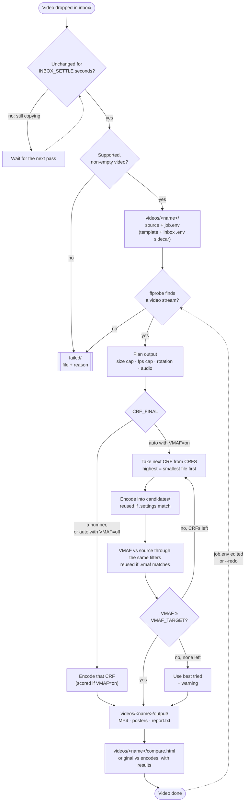

# Web Video Optimizer

Ask your AI coding agent to optimize a video. It looks at the footage, works out
how the video will be used, chooses the settings, and returns a web-ready MP4
that is as small as possible without visible quality loss, plus poster images
and a report.

- **Agent-driven.** The agent decides what a script can't know: whether the audio
  matters, what kind of picture it is, where it will play, which frame makes a
  good poster. [`AGENTS.md`](AGENTS.md) guides any coding agent, and a Claude Code
  skill is included.
- **Quality-gated.** Every encode is measured with
  [VMAF](https://github.com/Netflix/vmaf), Netflix's perceptual quality score. The
  smallest file that meets the target wins, so a poor setting costs bytes, not
  visible quality.
- **Docker only.** Nothing to install except Docker. ffmpeg, x264, VMAF and
  downloads all run inside a pinned container.
- **See the difference.** Every finished video gets a comparison page that plays
  the original and any encode under a draggable divider, next to the results.
- **One folder per video.** The source, settings, report, encode attempts,
  preview frames and finished files for a video all live in `videos/<name>/`.
- **Any input.** Landscape, portrait or square; rotated phone clips; odd sizes;
  high frame rates; with or without audio.

## Requirements

| You need | Notes |
|---|---|
| **Docker**, running | [Docker Desktop](https://docs.docker.com/get-docker/) on macOS and Windows, Docker Engine on Linux. **This is the only thing you install.** |
| A bash shell | Already on macOS and Linux. On Windows, run from WSL2 with Docker Desktop's WSL integration turned on. |
| An AI coding agent | Recommended, not required: [Claude Code](https://claude.com/claude-code), Codex, Cursor or any agent that can run commands and view images. |

You do **not** need ffmpeg, Homebrew packages, Python, Node or any codec
libraries. On your machine the script only moves files and keeps records with
built-in shell tools. Every video operation runs in the
`linuxserver/ffmpeg:9.0-cli-ls81` image, which is pulled automatically on the
first run. See [Docker details](#docker-details).

## Quick start with an AI agent

1. Get the project and start Docker:

   ```bash
   git clone https://github.com/Aplyca/web-video-optimizer.git
   ```

   ```bash
   cd web-video-optimizer
   ```

2. Open your agent in that folder and ask, saying **where the video will play**
   and **whether its audio matters**:

   > Optimize ~/Downloads/launch.mov. It's the muted background video on our
   > pricing page.

3. The agent follows [`AGENTS.md`](AGENTS.md):
   1. It inspects the video and looks at sampled frames.
   2. It asks you about anything it can't tell, such as whether a voice-over
      matters.
   3. It writes a small settings file with a reason for every choice.
   4. It runs the optimizer.
   5. It compares source and output frames, and adjusts if something looks off.
   6. It reports back.

4. Pick up the results in `videos/<name>/output/`:

   | File | What it is |
   |---|---|
   | `<name>.mp4` | H.264 High / yuv420p / AAC, `+faststart`, metadata stripped |
   | `<name>-poster.jpg`, `.webp` | Poster frame for `<video poster="…">` |
   | `report.txt` | Source details, the settings applied, every CRF tried with size and VMAF, the choice |

5. Check the result yourself by opening `videos/<name>/compare.html` in a browser
   (`open videos/<name>/compare.html` on macOS). See
   [Comparison page](#comparison-page).

**In Claude Code**, the bundled `optimize-video` skill loads automatically for
requests like the one above. **With other agents**, start with: "Read AGENTS.md,
then optimize …".

### What to tell the agent

The more the agent knows about how the video will be used, the better its choices:

- **Where it plays:** a full-screen background, a small embed in an article, a
  social post, a product page on mobile.
- **Audio:** muted autoplay, a voice-over that must stay clear, or music.
- **Budgets:** for example "must stay under 5 MB".
- **Several videos at once:** "Optimize everything in ~/exports/. They're
  tutorial clips with narration. Put the finished files in ~/exports/web/."

### Example

A real run, using a generated 1440p60 test clip (flat color fields, hard edges, a
small timecode readout, 5.1 audio) as the video:

> Optimize inbox/big.mp4. It's a short product demo shown as a small embed on a
> docs page, and the voice-over matters.

After inspecting the video and viewing its frames, the agent wrote
`inbox/big.mp4.env`:

```
# Small embed on a docs page (well under 800 px wide): 1080p would be wasted pixels
MAX_DIMENSION=1280
# Flat color fields, hard edges and fine checkerboard: synthetic, not camera footage
X264_TUNE=animation
# Small timecode text in the top-left corner must stay legible; VMAF under-weights text
VMAF_TARGET=94
# Voice-over matters, but speech doesn't need the source's 5.1 or stereo
AUDIO_CHANNELS=mono
AUDIO_BITRATE=96k
```

Then it ran the optimizer:

```
== big ==
  • Source: 5.64 MB | 2560x1440 @ 60 fps | 2 s | audio: aac
  • Output: 1280x720 @ 30 fps | audio: aac-96k-mono | preset slow | tune=animation
  ✓ CRF 34 -> 90.04 KB (-98.4%), VMAF 87.64 (below 94) [encoded]
  ✓ CRF 32 -> 104.41 KB (-98.1%), VMAF 90.69 (below 94) [encoded]
  ✓ CRF 30 -> 127.29 KB (-97.7%), VMAF 92.72 (below 94) [encoded]
  ✓ CRF 28 -> 169.48 KB (-97.0%), VMAF 93.96 (below 94) [encoded]
  ✓ CRF 26 -> 221.66 KB (-96.1%), VMAF 94.94 [encoded]
  ✓ Delivered videos/big/output/big.mp4 — 221.66 KB (-96.1%), CRF 26, VMAF 94.94
```

The higher quality target made the search go four steps further than the default
90 would have: CRF 26 instead of 32. That kept the small text crisp. Comparing
source and output frames afterwards, the timecode and checkerboard were intact,
and only a thin gradient line had softened slightly.

### Privacy

The agent views sampled frames (`--frames` writes JPEGs into the video's
`preview/` folder). With a cloud-hosted model, those images are sent to the model
provider as part of the conversation, under your agent's data terms. The videos
themselves are never uploaded: all processing is local, in Docker.

For confidential footage, tell the agent not to view frames and describe the
content yourself, or use the tool without an agent.

## Where everything goes

Each video gets one folder, named after the file (`Launch Video.MOV` →
`videos/launch-video/`):

```
inbox/                       drop videos here (optionally with <video>.env settings)
videos/
  launch-video/
    source.mov               the original, moved out of inbox/
    job.env                  settings for this video
    report.txt               history of every run
    compare.html             comparison page: original vs any encode, with results
    output/                  the deliverables
      launch-video.mp4
      launch-video-poster.jpg
      launch-video-poster.webp
      report.txt             the latest run
    preview/                 frames sampled for review (scratch)
    candidates/              encode attempts and cache files (scratch)
  _previews/                 frames sampled from files not processed yet (scratch)
failed/                      rejected files, each with a reason
```

To archive, share or delete a video, move, zip or delete its folder. The folders
marked scratch can be removed at any time with `./optimize.sh --clean`.

### Comparison page

Each delivered video gets `videos/<name>/compare.html`. Open it in any browser,
straight from disk: no server, and nothing is uploaded, since it only plays the
files in that folder.

- **Compare any two versions.** The original and the delivered encode are shown
  by default. Either side can switch to any encode the CRF search tried, so you
  can see where quality starts to break down. The two sides play in sync.
- **Inspect closely.** Drag the divider, step frame by frame (`←` `→`), slow down
  to ¼ speed, zoom up to 4× (hold `Shift` over the video to aim), or go full
  screen.
- **The results next to the picture.** Size and bitrate before and after, CRF,
  VMAF against the target, and every version's size, saving and score. It also
  shows the settings for this video with the reason written for each, the
  encoder details, warnings from the run, and the poster.

The page is rebuilt on every delivery. `./optimize.sh --compare NAME|all`
rebuilds it, for example after `--clean` removed the other encodes, or for videos
delivered before the page existed.

### Working with many videos

- **One run handles a batch.** `./optimize.sh` picks up every video in `inbox/`,
  processes them one after another, and ends with a summary table. A bad file is
  rejected or marked failed without stopping the others.
- **Per-video settings stay separate.** Each video's `.env` sidecar or `job.env`
  applies only to that video.
- **`./optimize.sh --list`** shows every video's status, size, CRF and VMAF.
- **`./optimize.sh --collect ~/Desktop/web`** copies every finished MP4 and its
  posters into one flat folder, ready to upload.
- **`./optimize.sh --clean all`** deletes the encode attempts and preview frames
  once you're happy with the results. They can add up to several times the size
  of the finished files. Sources, settings, reports and outputs are kept, and a
  later re-run simply encodes again.
- **Repeated filenames don't collide.** A second `clip.mov` becomes
  `videos/clip-2/`, and each report records the original filename.

Videos are encoded one at a time, and only one run can use a project folder at
once. To keep separate projects apart, clone the repository once per project.

## Using it without an agent

Everything the agent does is available directly. Drop videos in `inbox/` and run
the optimizer:

```bash
cp ~/Downloads/my-video.mov inbox/
```

```bash
./optimize.sh
```

Or leave a watcher running and drop files into `inbox/` whenever:

```bash
./optimize.sh --watch
```

Defaults suit general web video. To give one video its own settings, write the
same kind of sidecar the agent writes, **before** the video is picked up:

```bash
printf 'AUDIO=strip\nFPS=24\n' > inbox/background.mp4.env
```

```bash
cp ~/Downloads/background.mp4 inbox/
```

The decision guide in [`AGENTS.md`](AGENTS.md) is just as useful for choosing
settings by hand.

### Commands

| Command | Does |
|---|---|
| `./optimize.sh` | Process every video in `inbox/`, plus unfinished ones |
| `./optimize.sh FILE\|URL …` | Copy or download into `inbox/`, then process |
| `./optimize.sh --watch [SECONDS]` | Keep processing whatever lands in `inbox/` |
| `./optimize.sh --list` | Show videos and their status |
| `./optimize.sh --redo NAME\|all` | Re-process videos (matching encodes are reused) |
| `./optimize.sh --inspect FILE\|NAME` | Show source details and the output plan, no encoding |
| `./optimize.sh --frames FILE\|NAME [COUNT]` | Save sample frames for review; for a finished video, source and output frames at the same timestamps |
| `./optimize.sh --compare NAME\|all` | Rebuild `videos/NAME/compare.html`, the side-by-side comparison page |
| `./optimize.sh --collect DIR` | Copy every finished MP4 and its posters into `DIR` |
| `./optimize.sh --clean NAME\|all` | Delete encode attempts and preview frames; keep sources, settings, reports and outputs |

`NAME` is a video's folder name under `videos/`. Relative `FILE` and `DIR` paths
are resolved from the directory you run the command in. The exit code is
non-zero when any video failed or a file was rejected.

### Demo with generated clips

You can try it without your own footage. These commands use the same Docker
image to generate two 10-second clips in `inbox/`, both exported at very high
quality the way raw exports usually are:

- **`Product Demo.mov`:** a 1080p, 60 fps test pattern with a tone. It has flat
  areas and sharp edges, like screen recordings and motion graphics.
- **`background-loop.mp4`:** a portrait 1080×1920 fractal zoom with constant fine
  detail. This is hard to compress, like foliage, water or film grain.

```bash
docker run --rm --user "$(id -u):$(id -g)" -v "$PWD/inbox":/out --entrypoint ffmpeg \
  linuxserver/ffmpeg:9.0-cli-ls81 -hide_banner -loglevel error \
  -f lavfi -i testsrc2=size=1920x1080:rate=60 -f lavfi -i sine=frequency=440 \
  -t 10 -c:v libx264 -crf 12 -c:a aac -ac 2 -shortest "/out/Product Demo.mov"
```

```bash
docker run --rm --user "$(id -u):$(id -g)" -v "$PWD/inbox":/out --entrypoint ffmpeg \
  linuxserver/ffmpeg:9.0-cli-ls81 -hide_banner -loglevel error \
  -f lavfi -i mandelbrot=size=1080x1920:rate=30 -t 10 -c:v libx264 -crf 12 /out/background-loop.mp4
```

```bash
./optimize.sh
```

Real output from that run with default settings, on an 8-CPU Docker VM
(4 minutes in total, most of it VMAF scoring). The `background-loop` job's
per-CRF lines are shortened:

```
== Preflight ==
  ✓ ffmpeg: docker (docker:a8097f20436f)
  • Waiting 8s for files added to inbox/ in the last 10s to settle…
  ✓ Queued Product Demo.mov as videos/product-demo/
  ✓ Queued background-loop.mp4 as videos/background-loop/

== background-loop ==
  • Source: 69.59 MB | 1080x1920 @ 30 fps | 10 s | audio: none
  • Output: 1080x1920 @ source fps | audio: none | preset slow
  ✓ CRF 34 -> 2.23 MB (-96.8%), VMAF 61.46 (below 90) [encoded]
  ✓ CRF 32 -> 3.49 MB (-95.0%), VMAF 68.37 (below 90) [encoded]
    … CRF 30, 28 and 26 also score below 90 …
  ✓ CRF 24 -> 14.54 MB (-79.1%), VMAF 88.58 (below 90) [encoded]
  ✓ CRF 22 -> 18.50 MB (-73.4%), VMAF 91.68 [encoded]
  ✓ Delivered videos/background-loop/output/background-loop.mp4 — 18.50 MB (-73.4%), CRF 22, VMAF 91.68

== product-demo ==
  • Source: 30.46 MB | 1920x1080 @ 60 fps | 10 s | audio: aac
  • Output: 1920x1080 @ 30 fps | audio: aac-128k | preset slow
  • Encoding CRF 34…
  • Measuring VMAF for CRF 34 (roughly real-time)…
  ✓ CRF 34 -> 1.78 MB (-94.2%), VMAF 84.41 (below 90) [encoded]
  • Encoding CRF 32…
  • Measuring VMAF for CRF 32 (roughly real-time)…
  ✓ CRF 32 -> 2.21 MB (-92.8%), VMAF 87.64 (below 90) [encoded]
  • Encoding CRF 30…
  • Measuring VMAF for CRF 30 (roughly real-time)…
  ✓ CRF 30 -> 2.76 MB (-90.9%), VMAF 90.34 [encoded]
  ✓ Delivered videos/product-demo/output/product-demo.mp4 — 2.76 MB (-90.9%), CRF 30, VMAF 90.34

== Summary ==
  VIDEO                               SOURCE      OUTPUT   SAVED  CRF   VMAF  STATUS
  background-loop                   69.59 MB    18.50 MB   73.4%   22  91.68  videos/background-loop/output/
  product-demo                      30.46 MB     2.76 MB   90.9%   30  90.34  videos/product-demo/output/
```

What the run shows:

- **Search depth follows the content.** The test pattern reached the quality
  target at CRF 30 on the third try. The detailed fractal needed seven tries,
  down to CRF 22. One fixed CRF for both would either waste bytes on the easy
  clip or visibly damage the hard one.
- **Defaults adapt to the source.** The 60 fps clip was capped at 30 fps and its
  audio re-encoded to AAC. The portrait clip kept its orientation and full size,
  since 1920 px is within the cap.
- **Re-runs are cheap.** Running `./optimize.sh` again reports nothing to do.
  Editing `videos/product-demo/job.env` (for example `FPS=24` and `AUDIO=strip`)
  re-processes only that video.

Each video also gets a `report.txt`:

```
##### Run 2026-09-14 20:56:00 #####
Source:  Product Demo.mov | 30.46 MB | 1920x1080 @ 60 fps | 10 s | yuv420p | audio: aac
Output:  1920x1080 @ 30 fps | audio: aac-128k | x264 preset slow | docker:a8097f20436f
job.env: no overrides
Quality: auto, VMAF >= 90, trying CRF 34 32 30 28 26 24 22 20
  CRF 34: 1.78 MB (-94.2%), VMAF 84.41 (below 90) [encoded]
  CRF 32: 2.21 MB (-92.8%), VMAF 87.64 (below 90) [encoded]
  CRF 30: 2.76 MB (-90.9%), VMAF 90.34 [encoded]
Chosen:  CRF 30, VMAF 90.34 | 2.76 MB (-90.9% vs source, 2210 kb/s)
Output:  videos/product-demo/output/product-demo.mp4, product-demo-poster.jpg, product-demo-poster.webp
```

Generated clips are an extreme case: they start at very high bitrates and
contain no camera noise. Savings on real footage depend on how the source was
exported. A master-quality export typically shrinks by 90% or more, while a file
already compressed for the web shrinks much less.

## How it works



The agent's part happens before this flow starts. It writes the `inbox/<video>.env`
sidecar that becomes the video's settings. Afterwards it uses `--frames` to check
the result and edits `job.env` if something needs fixing.

1. **Ingest.** Each file in `inbox/` is moved into its own folder, `videos/<name>/`,
   where `<name>` is a slug of the filename (`My Clip.MOV` → `my-clip`, with `-2`,
   `-3`… for repeats). A file is picked up only after it has been unchanged for
   `INBOX_SETTLE` seconds (default 10), so a copy in progress isn't processed
   half-written. For transfers that may stall longer, copy under a temporary name
   such as `video.mp4.part` and rename it when done; `.part`, `.crdownload`,
   `.download` and `.tmp` files are always skipped. A `<video>.env` sidecar next
   to the file becomes the video's settings; drop it first or together with the
   video, since a sidecar that arrives after its video was picked up is reported
   as orphaned. Non-video, empty and unreadable files go to `failed/` with a
   reason. If ffmpeg reports read errors (a truncated or corrupt source), the
   video is still delivered but flagged with warnings in the summary and report.
2. **Plan.** ffprobe reads the source and the output is planned from the
   settings: the longest side capped at `MAX_DIMENSION` (never upscaled, always
   even), the frame rate capped at `MAX_FPS`, audio kept or stripped. Rotated
   phone videos are turned upright. A `job.env` template describing the source
   and the plan is written for per-video tweaks.
3. **Search.** With `CRF_FINAL=auto`, CRFs from `CRFS` are tried from highest
   (smallest file, fastest) to lowest. Each attempt is encoded into `candidates/`
   and scored with VMAF, and the first one reaching `VMAF_TARGET` is delivered,
   so easy content stops after one encode and harder content steps down only as
   far as needed. If nothing reaches the target, the best attempt is delivered
   with a warning.
4. **Deliver.** The chosen encode is copied to `videos/<name>/output/`, posters
   are taken from it (so they match what plays), and the run is appended to the
   video's `report.txt`.
5. **Compare.** `videos/<name>/compare.html` is written with the run's results
   and every version still on disk, ready to open in a browser.

### Caching and re-runs

Every candidate has a `.settings` sidecar recording everything that affects its
bytes: CRF, output size, frame rate, preset, tune, bitrate cap, audio plan and the
exact Docker image. VMAF scores are cached the same way. A re-run reuses a
candidate only when its sidecar matches, so changing a setting never serves a
stale file, and re-running with unchanged settings costs seconds. After
`--clean`, the next re-run encodes again.

A video counts as finished once `videos/<name>/.done` exists. It is processed
again when its `job.env` is edited or when you run `--redo`. A video that failed
is retried on the next `./optimize.sh`; the watcher skips it until `job.env`
changes, so a broken file isn't retried in a loop. Only one run can use a project
at a time.

### Measuring quality correctly

VMAF compares the encode against the source run through the **same** scale and
frame-rate filters. The score therefore reflects compression loss only, and the
frames stay aligned when the frame rate changes. Comparing a 24 fps encode
directly against a 30 fps source pairs up the wrong frames and gives meaningless
scores around 65–68. For that reason the frame rate is changed with ffmpeg's `fps`
filter rather than `-r`, which selects different frames. libvmaf runs
single-threaded on purpose: its thread pool buffers decoded frames without limit
and was killed for running out of memory on a 1080p source with 8 GB for Docker.

Scoring takes roughly the video's duration per candidate.

VMAF under-weights small-text sharpness and color banding. That's why the agent
raises `VMAF_TARGET` for text-heavy or gradient-heavy content, and why it checks
frames visually as well.

## Settings

Settings come from four layers; later layers win:

1. Built-in defaults (`lib/config.sh`)
2. `config.env`, for every video in this project
3. Per-video settings, which end up in `videos/<name>/job.env`. They're set
   either:
   - before processing, by a sidecar named after the video plus `.env` next to it
     in `inbox/` (`clip.mov` → `clip.mov.env`). This is what the agent writes.
   - afterwards, by uncommenting lines in the generated `job.env`, which
     re-processes the video on the next run.
4. Environment variables, for one run: `VMAF=off ./optimize.sh`. These override
   `job.env` for every video processed in that run, so pair them with
   `--redo <name>` to target one video.

The config files are parsed as `KEY=VALUE`, never executed.

| Setting | Default | Meaning |
|---|---|---|
| `CRF_FINAL` | `auto` | `auto` searches `CRFS` with VMAF; a number 1–51 forces that CRF |
| `CRFS` | `20 22 … 34` | CRFs the search may try (lower = better quality, bigger file) |
| `CRF_FALLBACK` | `26` | CRF used when `auto` but `VMAF=off` |
| `VMAF` | `on` | `off` skips scoring (much faster, no quality gate) |
| `VMAF_TARGET` | `90` | Minimum score; 90+ is visually transparent for most viewers |
| `MAX_DIMENSION` | `1920` | Longest side in pixels |
| `FPS` | `auto` | `auto` caps at `MAX_FPS`; `keep` never changes it; a number caps to it |
| `MAX_FPS` | `30` | Cap used by `FPS=auto` |
| `AUDIO` | `keep` | `keep` re-encodes to AAC; `strip` removes it |
| `AUDIO_BITRATE` | `128k` | AAC bitrate |
| `AUDIO_CHANNELS` | `auto` | `auto` downmixes surround only; `mono` for speech; `stereo` always two channels |
| `X264_PRESET` | `slow` | Slower presets give smaller files at the same quality |
| `X264_TUNE` | `none` | `film`, `animation`, `grain` or `stillimage` to tune x264 for the content |
| `MAX_BITRATE` | `none` | Video bitrate cap such as `900k` or `3M`, for strict size budgets |
| `POSTER_TIME` | `1` | Poster frame time in seconds (clamped to half the duration) |
| `FFMPEG_IMAGE` | `linuxserver/ffmpeg:9.0-cli-ls81` | Docker image all video work runs in (config.env or environment only) |
| `WATCH_INTERVAL` | `10` | Seconds between inbox checks in `--watch` mode (config.env or environment only) |
| `INBOX_SETTLE` | `10` | Seconds a file must be unchanged before it is picked up (config.env or environment only) |

[`AGENTS.md`](AGENTS.md) maps intended uses and content types to these settings.

### Common recipes

**Muted autoplay background or hero video:**

```
AUDIO=strip
FPS=24
```

Put these lines in `inbox/<video>.env` before the video is processed, in an
existing video's `videos/<name>/job.env`, or in `config.env` if every video in the
project is a background loop. When you pass a file as an argument
(`./optimize.sh ~/clips/background.mp4`), a `background.mp4.env` next to it is
copied along with it. `--inspect` on an inbox file also applies its sidecar, so
you can preview the plan first.

**Re-process one video with a fixed CRF:**

```bash
CRF_FINAL=24 ./optimize.sh --redo my-video
```

**Fast draft pass without scoring:**

```bash
VMAF=off X264_PRESET=medium ./optimize.sh
```

## Docker details

- **What runs where.** On your machine, bash only moves files, reads settings and
  writes reports. Every `ffmpeg`, `ffprobe` and download (`curl`) call is a
  short-lived `docker run --rm` of the pinned image. The project folder is mounted
  at `/work`, and for a file outside the project, its folder is mounted read-only
  at `/in`. There's no long-running container or compose file.
- **Files stay yours.** Containers run with your user and group IDs, so outputs
  aren't owned by root on Linux.
- **Reproducible.** The image is pinned (`FFMPEG_IMAGE`), and its image ID is part
  of every cache key. Switching images re-encodes instead of mixing results.
- **Resources.** Encoding uses all CPUs Docker is allowed. VMAF scoring stays
  around 400 MB of memory even for 1080p, so Docker Desktop's default limits are
  enough.
- **Downloads.** `./optimize.sh URL` downloads inside the container. For a server
  on your own machine, use `host.docker.internal` instead of `localhost`.
- **No Docker needed for bookkeeping.** `--list`, `--collect` and `--clean` only
  read or delete local files, so they work even when Docker isn't running.
- **Uninstalling.** Delete the project folder, then remove the image with
  `docker image rm linuxserver/ffmpeg:9.0-cli-ls81`. Nothing else was installed.

## Limitations

- **Output format.** H.264/MP4 only, the format every browser plays. No AV1 or
  VP9 variants yet.
- **HDR.** HDR sources (PQ/HLG) are converted to SDR without tone mapping. A
  warning is logged, and colors may look washed out.
- **Scaling.** VMAF measures compression loss at the output resolution, not what
  is lost by scaling down.
- **Aspect ratio.** Anamorphic sources with non-square pixels are not corrected.

## Project layout

```
AGENTS.md          guide for AI agents: procedure, decision guide, rules
.claude/skills/    Claude Code skill (optimize-video) that follows AGENTS.md
optimize.sh        entry point and command-line options
config.env         project-wide defaults
lib/util.sh        logging and portable helpers
lib/config.sh      settings layers, parsing and validation
lib/media.sh       Docker ffmpeg calls, probing, output plan, encode, VMAF, posters
lib/jobs.sh        inbox ingest, per-video folders, reports, watch, list, frames,
                   collect, clean
lib/compare.sh     the comparison page (compare.html) and --compare
inbox/             drop videos (and .env sidecars) here
videos/  failed/   created at runtime (git-ignored)
```

## Contributing

Linting also runs in Docker, so there's nothing to install. CI runs the same check:

```bash
docker run --rm -v "$PWD":/mnt -w /mnt koalaman/shellcheck:stable -x -s bash -S warning optimize.sh
```
